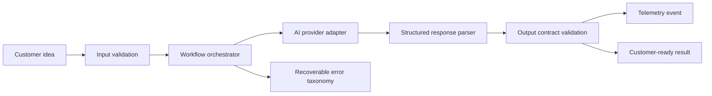

# Architecture Overview

Kilev AI is a localized AI product workflow: a user submits a business idea, the system validates the request, generates structured brand strategy directions, scores the output, and prepares downstream assets such as naming, logo directions, and brand book content.

This public showcase exposes only a safe slice of that architecture.

## High-Level Flow

## Production Pattern

The production system separates:

- product UI
- API contracts
- AI orchestration
- model/provider adapters
- validation and policy checks
- storage and audit logging
- observability and incident review

This separation makes the product easier to test, localize, monitor, and safely evolve.

## Why This Matters for Banking

Digital banking incidents often become expensive when flows are not observable enough. A customer lockout can involve identity state, password validation, device binding, OTP, account lookup, customer support tooling, and notification reliability.

The same architectural pattern used here can be applied to banking recovery flows:

- define the state machine
- validate every transition
- classify failures
- redact sensitive data
- monitor externally visible user impact
- give support teams a clear incident timeline

